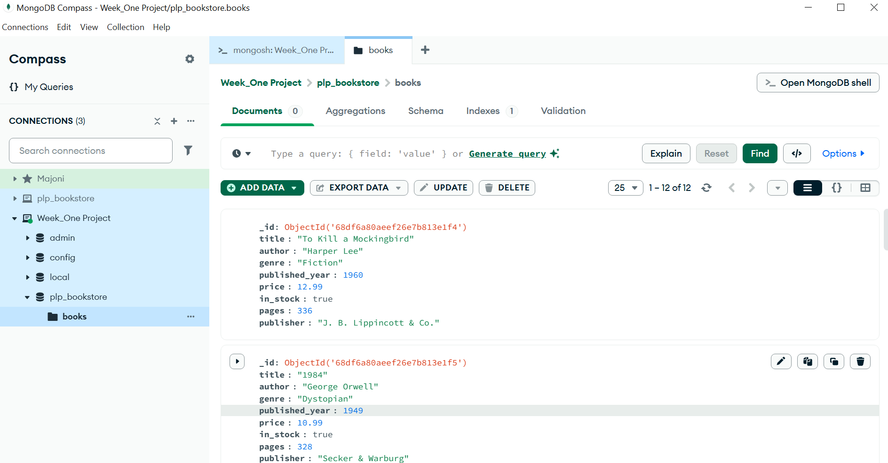

# 📚 MongoDB Week 1 Assignment – PLP Bookstore

## 🚀 Overview
This project demonstrates MongoDB fundamentals using a simple bookstore database.  
Tasks completed include:
- Setting up MongoDB
- Performing CRUD operations
- Running advanced queries (projection, sorting, pagination)
- Using aggregation pipelines
- Creating indexes and analyzing performance

---

## 🛠️ Setup Instructions

### 1. Requirements
- [Node.js](https://nodejs.org/) (v18+)
- [MongoDB Community Edition](https://www.mongodb.com/try/download/community) or a free [MongoDB Atlas](https://www.mongodb.com/cloud/atlas) account
- [MongoDB Compass](https://www.mongodb.com/products/compass) (for GUI exploration)

### 2. Installation
Clone this repository and install dependencies:
```bash
git clone <your-repo-link>
cd <your-repo-folder>
npm install

## Screenshot
Below is a screenshot of the MongoDB Compass showing the `plp_bookstore` database with the `books` collection:


